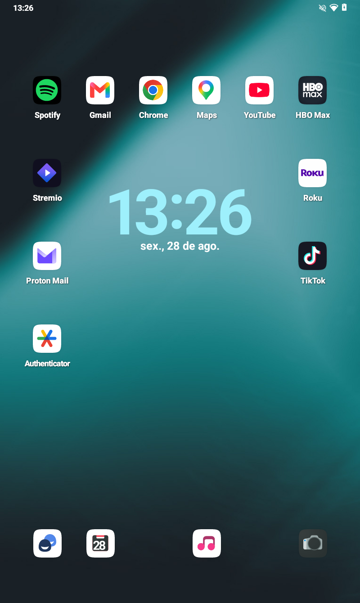
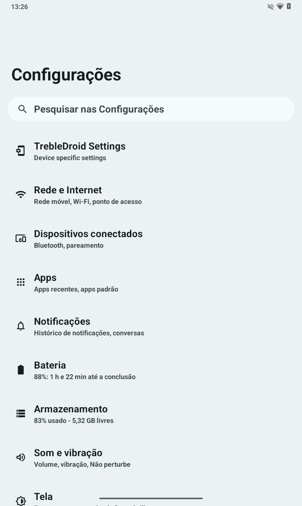

<a id="top"></a>

<div align="center">

# Sistema2D · SM-T225

**A LineageOS 21 GSI, tuned end to end for the Galaxy Tab A7 Lite**

iPad-style interface · tablet layouts unlocked · continuous SAMSUNG boot · no bloat added

[](https://buymeacoffee.com/hugomelovek)
[](LICENSE)
[](https://www.linkedin.com/in/hugoaraujo92/)
[](https://github.com/Sistema2D/SM-T225/releases/tag/v1.0.0)
[](https://github.com/Sistema2D/SM-T225)
[](https://github.com/Sistema2D/FrameCode-VibeWork)

Stable release **v1.0.0** · Android 14 · [Project page](https://sistema2d.github.io/SM-T225/)

[](#pt-br)
[](#en-us)

</div>

---

<div align="center">
  
</div>

---

<a id="en-us"></a>

## English

### What it is

Sistema2D is **not a ROM built from source**. It is a tuning layer applied on top of an
existing LineageOS 21 GSI, delivered as Magisk modules and RRO overlays. The base system
image is untouched — everything that makes this project is in the layer, which means it
installs in minutes and reverts by disabling a module.

The target is one device: the **Samsung Galaxy Tab A7 Lite LTE (SM-T225 / gta7lite)**,
a MediaTek MT6765 with 3 GB of RAM. Every decision here was measured on that hardware,
not assumed.

> **Read this before flashing.** Unlocking the bootloader wipes the tablet and trips the
> Knox fuse permanently, which disables Samsung Pass and Secure Folder for good. This is
> irreversible. Nothing in this repository can undo it.

### What it changes

| Area | Before | After |
|---|---|---|
| Usable width | `sw582dp` — phone layouts | **`sw640dp`** — taskbar, two-pane Settings |
| Icon shape | AOSP squircle | **n=5 superellipse** (the iOS curve) |
| App icons | monochrome themed | **full colour**, iPad-style |
| Screen corners | square | **rounded, 20dp** |
| Boot screen | SAMSUNG → ~17 s black → animation | **continuous SAMSUNG screen** |
| Boot time | 44.475 ms | **42.934 ms** |
| Perfetto daemons | 2 resident | **0** |
| SystemUI jank | 35.3% | **15.7%** |

### The density finding

The single largest change is one number. The panel is 800×1340 at a physical density of
213, but the system carried a 220 dpi override — which put the usable width at
**582 dp**, just under Android's **600 dp** threshold for large-screen layouts.

Eighteen dp were costing the tablet its taskbar, its two-column Settings and its
multi-window behaviour. Dropping to 200 dpi gives 640 dp and hands all of it back.

### Boot: measured, not guessed

The black screen between the Samsung splash and the animation was not "a few seconds".
Measured with `ro.boottime.*`:

```
~13.8 s   bootloader hands off, SAMSUNG screen disappears
 22.5 s   surfaceflinger
 31.2 s   bootanimation finally draws
```

Surfaceflinger comes up **8.6 s before anything is drawn**. The fix paints the SAMSUNG
screen straight into `/dev/graphics/fb0` from `post-fs-data`, and keeps repainting until
`init.svc.bootanim` takes over — which proved that surfaceflinger, running but with
nothing to compose, does not clear the framebuffer.

The 150-frame animation was measured to cost **~2.0 s**. Removing it outright would have
left twenty seconds of black, so it was replaced by a **single static frame** of the same
SAMSUNG screen: 78% of the time back, and the panel stays lit the whole way.

Around 7 s of black remain, from the bootloader handing off until `post-fs-data` runs.
That is the earliest hook Magisk offers; closing it would need a kernel change.

### Screenshots

| Home | Settings | Quick settings | Boot |
|---|---|---|---|
|  |  |  |  |

### Credits — the work this is built on

This project is a layer. The system underneath is other people's work, and it is the
larger part of what you will be running.

- **[LineageOS](https://lineageos.org/)** — the Android 14 base. This project uses the
  `lineage-21.0-arm64_bgN` GSI build; nothing in the system image was modified.
- **[phhusson / Treble Experimentations](https://github.com/phhusson/treble_experimentations)**
  — the Treble patches and overlays that make a generic system image run on Samsung
  vendor code at all. Five `me.phh.treble.*` overlays are active on the running device.
- **[TrebleDroid](https://github.com/TrebleDroid/treble_experimentations)** — the GSI
  lineage this build descends from.
- **[Magisk](https://github.com/topjohnwu/Magisk)** by topjohnwu — the entire delivery
  mechanism. Every part of Sistema2D is a Magisk module.
- **[TeamWin / TWRP](https://twrp.me/)** — the recovery used to install the GSI.
- **Samsung** — the device, the bootloader and the vendor partition, which stays stock.

Sistema2D is the tuning layer only: the boot art, the RRO overlays, the measurements and
the scripts in this repository.

### Installation

The full procedure is in **[INSTALL.md](INSTALL.md)** — from a stock tablet to a booted
system, with the exact key combinations and what each step is for.

Short version:

1. Unlock the bootloader (**wipes everything, trips Knox**).
2. Flash TWRP with Odin, `Auto Reboot` **off**.
3. In TWRP: format data, flash the FBE disabler.
4. Flash the LineageOS GSI to the system partition.
5. Flash Magisk.
6. Flash the four Sistema2D modules.
7. Reboot, then run `rom/ajustes/aplicar-ajustes.ps1`.

### What is in this repository

```
rom/modulos/      the four Magisk modules — this is the ROM
rom/overlays/     RRO sources and the reproducible build script
rom/boot/         boot art generators and the 55 stock up_param resources
rom/ajustes/      apply/revert scripts for settings-level tuning
rom/empacotar.py  packages the modules into flashable zips
ferramentas/      downloader for the third-party tools
docs/             project page and screenshots
```

### What is not in this repository, and why

Samsung's stock firmware (6 GB), Odin and the Samsung USB driver are Samsung's property
and are not redistributed here. The Android platform-tools come from Google's own stable
URL. `ferramentas/baixar-ferramentas.ps1` fetches each of them from its official source
and checks the SHA-256 against the versions this project was actually tested with.

TWRP and Magisk are open source and **are** published in the
[release](https://github.com/Sistema2D/SM-T225/releases), as the exact builds used.

### Reverting

Every change is reversible and documented:

- Interface and boot: disable the Magisk modules.
- Settings-level tuning: `rom/ajustes/reverter-ajustes.ps1`.
- Bootloader splash: reflash the factory `up_param` backup.
- The whole system: reflash Samsung's stock firmware with Odin.

The Knox fuse is the exception. It does not come back.

### License

Apache 2.0 — see [LICENSE](LICENSE). The credited projects keep their own licenses.

---

<a id="pt-br"></a>

## Português

### O que é

Sistema2D **não é uma ROM compilada do zero**. É uma camada de ajuste aplicada sobre uma
GSI LineageOS 21 existente, entregue como módulos Magisk e overlays RRO. A imagem de
sistema não é tocada — tudo que constitui este projeto está na camada, o que significa
que instala em minutos e se desfaz desativando um módulo.

O alvo é um aparelho só: o **Samsung Galaxy Tab A7 Lite LTE (SM-T225 / gta7lite)**, um
MediaTek MT6765 com 3 GB de RAM. Cada decisão aqui foi medida nesse hardware, não
presumida.

> **Leia antes de gravar.** Desbloquear o bootloader apaga o tablet e queima o fusível
> Knox de forma permanente, o que desativa Samsung Pass e Pasta Segura para sempre. É
> irreversível. Nada neste repositório desfaz isso.

### O que muda

| Área | Antes | Depois |
|---|---|---|
| Largura útil | `sw582dp` — layout de telefone | **`sw640dp`** — taskbar, Configurações em duas colunas |
| Forma do ícone | squircle do AOSP | **superelipse n=5** (a curva do iOS) |
| Ícones | monocromáticos temáticos | **coloridos**, estilo iPad |
| Cantos da tela | quadrados | **arredondados, 20dp** |
| Tela de boot | SAMSUNG → ~17 s preto → animação | **tela SAMSUNG contínua** |
| Tempo de boot | 44.475 ms | **42.934 ms** |
| Daemons Perfetto | 2 residentes | **0** |
| Jank da SystemUI | 35,3% | **15,7%** |

### A descoberta da densidade

A maior mudança do projeto é um número só. O painel tem 800×1340 com densidade física
213, mas o sistema carregava uma sobreposição de 220 dpi — que colocava a largura útil em
**582 dp**, logo abaixo do corte de **600 dp** que o Android usa para layouts de tela
grande.

Dezoito dp custavam ao tablet a taskbar, as Configurações em duas colunas e o
comportamento de multi-janela. Baixar para 200 dpi dá 640 dp e devolve tudo isso.

### Boot: medido, não chutado

A tela preta entre a splash da Samsung e a animação não era "alguns segundos". Medido por
`ro.boottime.*`:

```
~13,8 s   o bootloader sai e some com a tela SAMSUNG
 22,5 s   surfaceflinger
 31,2 s   a bootanimation finalmente desenha
```

O surfaceflinger sobe **8,6 s antes de qualquer coisa ser desenhada**. A correção pinta a
tela SAMSUNG direto em `/dev/graphics/fb0` a partir do `post-fs-data`, e continua
repintando até `init.svc.bootanim` assumir — o que provou que o surfaceflinger, de pé mas
sem nada para compor, não limpa o framebuffer.

A animação de 150 quadros custava **~2,0 s**, medidos. Removê-la de vez deixaria vinte
segundos de tela preta, então foi trocada por um **único quadro estático** da mesma tela
SAMSUNG: 78% do tempo de volta, e o painel fica aceso o caminho inteiro.

Restam cerca de 7 s de preto, do bootloader sair até o `post-fs-data` rodar. É o gancho
mais cedo que o Magisk oferece; fechar isso exigiria mexer no kernel.

### Capturas

| Início | Configurações | Painel rápido | Boot |
|---|---|---|---|
|  |  |  |  |

### Créditos — o trabalho em que isto se apoia

Este projeto é uma camada. O sistema por baixo é trabalho de outras pessoas, e é a maior
parte do que você vai rodar.

- **[LineageOS](https://lineageos.org/)** — a base Android 14. Este projeto usa a GSI
  `lineage-21.0-arm64_bgN`; nada na imagem de sistema foi modificado.
- **[phhusson / Treble Experimentations](https://github.com/phhusson/treble_experimentations)**
  — os patches e overlays Treble que permitem uma imagem genérica rodar sobre o vendor da
  Samsung. Cinco overlays `me.phh.treble.*` estão ativos no aparelho.
- **[TrebleDroid](https://github.com/TrebleDroid/treble_experimentations)** — a linhagem
  de GSI da qual esta build descende.
- **[Magisk](https://github.com/topjohnwu/Magisk)** do topjohnwu — todo o mecanismo de
  entrega. Cada parte do Sistema2D é um módulo Magisk.
- **[TeamWin / TWRP](https://twrp.me/)** — o recovery usado para instalar a GSI.
- **Samsung** — o aparelho, o bootloader e a partição vendor, que continua de fábrica.

O Sistema2D é só a camada de ajuste: a arte de boot, os overlays RRO, as medições e os
scripts deste repositório.

### Instalação

O procedimento completo está em **[INSTALL.md](INSTALL.md)** — do tablet de fábrica ao
sistema iniciado, com as combinações de teclas exatas e o porquê de cada passo.

Versão curta:

1. Desbloquear o bootloader (**apaga tudo e queima o Knox**).
2. Gravar o TWRP pelo Odin, com `Auto Reboot` **desmarcado**.
3. No TWRP: formatar data e gravar o desativador de FBE.
4. Gravar a GSI do LineageOS na partição system.
5. Gravar o Magisk.
6. Gravar os quatro módulos Sistema2D.
7. Reiniciar e rodar `rom/ajustes/aplicar-ajustes.ps1`.

### O que tem neste repositório

```
rom/modulos/      os quatro módulos Magisk — é isto que é a ROM
rom/overlays/     fontes dos RRO e o script de build reprodutível
rom/boot/         geradores da arte de boot e os 55 recursos do up_param
rom/ajustes/      scripts de aplicar/reverter os ajustes de settings
rom/empacotar.py  empacota os módulos em zips flasháveis
ferramentas/      baixador das ferramentas de terceiros
docs/             página do projeto e capturas
```

### O que não está aqui, e por quê

O firmware de fábrica da Samsung (6 GB), o Odin e o driver USB são propriedade da Samsung
e não são redistribuídos. As platform-tools vêm da URL estável do próprio Google. O
`ferramentas/baixar-ferramentas.ps1` busca cada um na fonte oficial e confere o SHA-256
contra as versões com que este projeto foi de fato testado.

TWRP e Magisk são abertos e **estão** publicados na
[release](https://github.com/Sistema2D/SM-T225/releases), nas builds exatas usadas.

### Reverter

Toda mudança é reversível e documentada:

- Interface e boot: desative os módulos Magisk.
- Ajustes de settings: `rom/ajustes/reverter-ajustes.ps1`.
- Splash do bootloader: regrave o backup de fábrica do `up_param`.
- O sistema inteiro: regrave o firmware de fábrica pelo Odin.

O fusível Knox é a exceção. Esse não volta.

### Licença

Apache 2.0 — veja [LICENSE](LICENSE). Os projetos creditados mantêm as próprias licenças.

---

<div align="center">

[⬆ Back to top / Voltar ao topo](#top)

**By [Sistema2D](https://github.com/Sistema2D)** · [Buy Me a Coffee](https://buymeacoffee.com/hugomelovek) · [LinkedIn](https://www.linkedin.com/in/hugoaraujo92/)

</div>
