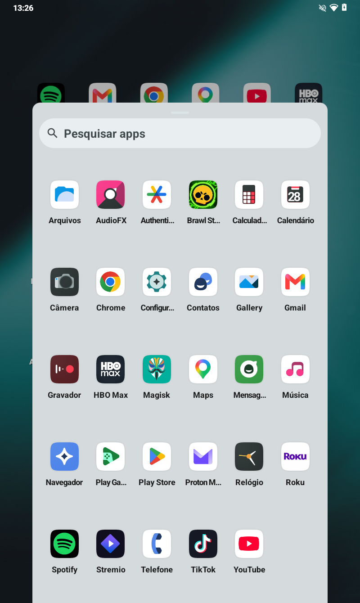
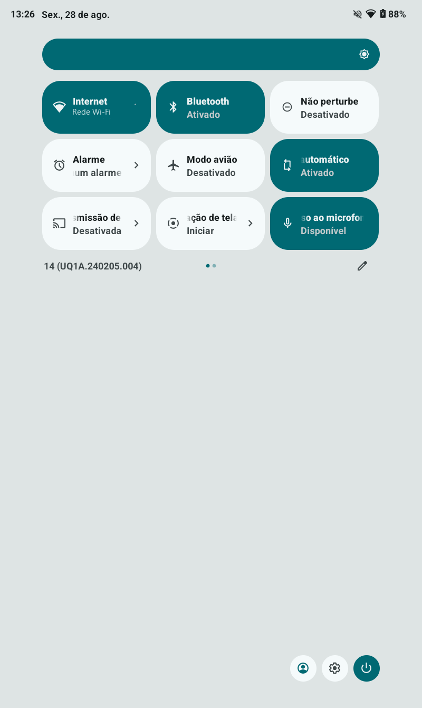
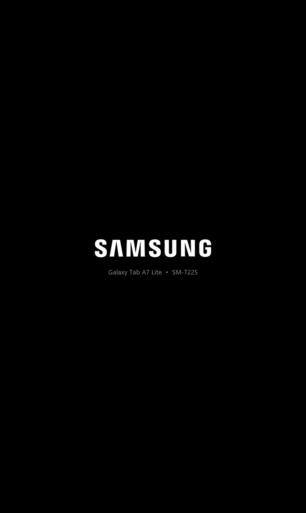

<a id="top"></a>

<div align="center">

# Sistema2D · SM-T225

Camada de ajuste para uma GSI LineageOS 21 no Samsung Galaxy Tab A7 Lite (SM-T225).

Módulos Magisk e overlays RRO. A imagem de sistema não é modificada.

[](https://buymeacoffee.com/hugomelovek)
[](LICENSE)
[](https://www.linkedin.com/in/hugoaraujo92/)
[](https://github.com/Sistema2D/SM-T225/releases/tag/v1.0.0)
[](https://github.com/Sistema2D/SM-T225)
[](https://github.com/Sistema2D/FrameCode-VibeWork)

Versão **v1.0.0** · Android 14

[](#pt-br)
[](#en-us)

</div>

---

<div align="center">
  
</div>

---

<a id="en-us"></a>

## English

### What it is

Sistema2D is not a ROM built from source. It is a tuning layer applied on top of an
existing LineageOS 21 GSI, delivered as Magisk modules and RRO overlays. The base system
image is not modified, so the layer installs in minutes and is undone by disabling a
module.

It targets one device: the Samsung Galaxy Tab A7 Lite LTE (SM-T225 / gta7lite), a
MediaTek MT6765 with 3 GB of RAM. The figures below were measured on that hardware.

> **Read this before flashing.** Unlocking the bootloader wipes the tablet and trips the
> Knox fuse permanently, which disables Samsung Pass and Secure Folder for good. This is
> irreversible. Nothing in this repository can undo it.

### What it changes

| Area | Before | After |
|---|---|---|
| Usable width | `sw582dp` — phone layouts | **`sw640dp`** — taskbar, two-pane Settings |
| Icon shape | AOSP squircle | **n=5 superellipse** (the iOS curve) |
| App icons | monochrome themed | **full colour**, iPad-style |
| Screen corners | square | **rounded, 20dp** |
| Boot screen | SAMSUNG → ~17 s black → animation | **continuous SAMSUNG screen** |
| Boot time | 44.475 ms | **42.934 ms** |
| Perfetto daemons | 2 resident | **0** |
| SystemUI jank | 35.3% | **15.7%** |

### Density

The panel is 800×1340 at a physical density of 213, but the system carried a 220 dpi
override, which put the usable width at 582 dp — under Android's 600 dp threshold for
large-screen layouts. At that width the system uses phone layouts: no taskbar, no
two-column Settings, reduced multi-window behaviour.

Setting 200 dpi gives 640 dp and the large-screen layouts apply.

### Boot

Timings measured with `ro.boottime.*`:

```
~13.8 s   bootloader hands off, SAMSUNG screen disappears
 22.5 s   surfaceflinger
 31.2 s   bootanimation finally draws
```

Surfaceflinger starts 8.6 s before anything is drawn, so the panel is black in that
window. The layer writes the SAMSUNG screen into `/dev/graphics/fb0` from `post-fs-data`
and repeats until `init.svc.bootanim` takes over; surfaceflinger, running with nothing to
compose, does not clear the framebuffer.

The 150-frame animation cost about 2.0 s. Removing it entirely would leave roughly twenty
seconds of black screen, so it was replaced by a single static frame of the same image:
1.54 s of the 1.98 s recovered, with the panel lit throughout.

About 7 s of black remain, between the bootloader handing off and `post-fs-data` running.
That is the earliest hook Magisk provides; removing it would require a kernel change.

### Screenshots

| Home | App drawer | Settings | Quick settings | Boot |
|---|---|---|---|---|
|  |  |  |  |  |

### Credits

The system underneath is other people's work and is the larger part of what runs on the
device.

- **[LineageOS](https://lineageos.org/)** — the Android 14 base. This project uses the
  `lineage-21.0-arm64_bgN` GSI build; nothing in the system image was modified.
- **[phhusson / Treble Experimentations](https://github.com/phhusson/treble_experimentations)**
  — the Treble patches and overlays that make a generic system image run on Samsung
  vendor code at all. Five `me.phh.treble.*` overlays are active on the running device.
- **[TrebleDroid](https://github.com/TrebleDroid/treble_experimentations)** — the GSI
  lineage this build descends from.
- **[Magisk](https://github.com/topjohnwu/Magisk)** by topjohnwu — the entire delivery
  mechanism. Every part of Sistema2D is a Magisk module.
- **[TeamWin / TWRP](https://twrp.me/)** — the recovery used to install the GSI.
- **Samsung** — the device, the bootloader and the vendor partition, which stays stock.

Sistema2D covers only the tuning layer: the boot art, the RRO overlays and the scripts in
this repository.

### Installation

Requirements: an **SM-T225** (not the T220 Wi-Fi model, the vendor partition differs), a
Windows PC, a USB cable, and the tablet at 60%+ battery. Around 40 minutes.

#### Step 0 — Get the files

Run `ferramentas/baixar-ferramentas.ps1`. It downloads Odin, the Samsung USB driver and
Google's platform-tools from their official sources and checks each SHA-256 against the
versions this project was tested with.

From the [release](https://github.com/Sistema2D/SM-T225/releases), download:

| File | What it is |
|---|---|
| `lineage-21.0-arm64_bgN.img.gz` | The LineageOS GSI — the base system |
| `TWRP_v2.2_gta7lite.tar` | Recovery, flashed with Odin |
| `fbe_disabler_gta7lite.zip` | Disables file-based encryption so TWRP can read `/data` |
| `Magisk-v30.7.apk` | Root, and the delivery mechanism for every module |
| `sistema2d_*.zip` (four files) | The Sistema2D layer |
| `99-aosp-tweaks.sh` | sysctl tuning, goes to `/data/adb/service.d/` |

Install the Samsung USB driver and reboot the PC. Windows will not see Download Mode
without it.

#### Step 1 — Unlock the bootloader

1. **Settings → About tablet → Software information**, tap **Build number** seven times.
2. **Settings → Developer options**: enable **USB debugging** and **OEM unlocking**.
   If *OEM unlocking* is missing, connect to Wi-Fi and wait — Samsung gates it for about
   7 days after a factory reset.
3. Power off completely.
4. Hold **Volume Up + Volume Down** together and plug in the USB cable.
5. At the warning screen, hold **Volume Up** for a few seconds to enter
   *Device Unlock Mode*.
6. Confirm with **Volume Up**. The tablet wipes itself and reboots.
7. Run through setup, connect to Wi-Fi, and confirm in Developer options that
   **OEM unlocking is still on and greyed out** — that means it took.

#### Step 2 — Flash TWRP

1. Power off. Hold **Volume Up + Volume Down**, plug in the cable, then tap **Volume Up**
   once to enter Download Mode.
2. Open `Odin3_v3.14.4.exe`. The **ID:COM** box must turn blue. If it stays grey, the
   driver is not installed.
3. In **Options**, **uncheck `Auto Reboot`**. If the tablet reboots on its own, stock
   Android restores its own recovery and TWRP is gone.
4. Click **AP**, pick `TWRP_v2.2_gta7lite.tar`, then **Start**. Wait for the green
   **PASS!**

#### Step 3 — First boot into TWRP, and decrypt

Timing matters. Straight from the Download Mode screen:

1. Hold **Power + Volume Down** for ~7 seconds until the screen goes dark.
2. The instant it goes dark, switch to **Power + Volume Up** and hold until the TWRP logo
   appears.

If you land in Android instead, stock recovery already replaced TWRP — redo step 2.

In TWRP:

3. Swipe to **Allow Modifications**.
4. **Wipe → Format Data**, type `yes`, confirm. This removes the encryption that stops
   TWRP from reading `/data`.
5. **Reboot → Recovery** to come back with the partitions readable.
6. Copy `fbe_disabler_gta7lite.zip` to the tablet (`adb push` or USB storage) and
   **Install** it.

#### Step 4 — Flash the GSI

1. Decompress `lineage-21.0-arm64_bgN.img.gz` and copy the `.img` to the tablet. TWRP
   needs the uncompressed image.
2. **Install → Install Image**.
3. Pick the `.img` and target the **System Image** partition. Swipe to confirm.
4. **Wipe → Advanced Wipe** → check **Cache** and **Dalvik / ART Cache** → swipe.
5. **Reboot → System.** The first boot takes 2–5 minutes. Complete the Android setup.

At this point you have plain LineageOS. Everything so far is other people's work — see
the credits above.

#### Step 5 — Magisk

Install `Magisk-v30.7.apk` on the running system, open it, and follow any additional
setup it asks for.

#### Step 6 — The Sistema2D layer

In the Magisk app, **Modules → Install from storage**, one at a time:

| Order | Module | What it does |
|---|---|---|
| 1 | `sistema2d_tweaks.zip` | Turns off the Perfetto daemons |
| 2 | `sistema2d_bootanim.zip` | Continuous SAMSUNG boot screen |
| 3 | `sistema2d_ui_ios.zip` | The interface overlays |
| 4 | `sistema2d_rom_provisioning.zip` | pt-BR locale on first boot |

Then place the sysctl script:

```bash
adb push 99-aosp-tweaks.sh /data/local/tmp/
adb shell su -c 'cp /data/local/tmp/99-aosp-tweaks.sh /data/adb/service.d/ && chmod 0755 /data/adb/service.d/99-aosp-tweaks.sh'
```

**Reboot.** The overlays enable themselves on the first boot after install.

#### Step 7 — Settings-level tuning

The density and the animation scales live in Android's settings, not in a module:

```powershell
.
omjustesplicar-ajustes.ps1
```

This is the step that applies the 200 dpi change. Without it the tablet keeps phone
layouts.

#### Step 8 — Optional: the bootloader splash

The SAMSUNG screen the bootloader shows lives in the `up_param` partition. Replacing it
is the only genuinely risky operation here — that partition also holds the Download Mode
and recovery screens.

It is entirely optional; only the very first screen differs. The image, the validator and
the procedure are in `rom/boot/`. Back up the partition and verify the SHA-256 before and
after.

#### Verifying

```bash
adb shell am get-config | grep -o "sw[0-9]*dp"      # expect sw640dp
adb shell cmd overlay list | grep sistema2d          # expect four [x]
adb shell getprop persist.traced.enable              # expect 0
```

#### If something goes wrong

| Symptom | Cause and fix |
|---|---|
| Odin: `FAIL! (Auth)` | Bootloader still locked, or the wrong file in AP. |
| TWRP replaced by stock recovery | `Auto Reboot` was left on in step 2. Redo it. |
| TWRP shows `/data` as `0 MB` | Format Data was skipped in step 3. |
| Boot loops after the GSI | Wipe Cache and Dalvik, then reboot again. |
| Overlays not applied | Check `logcat -b all \| grep denied`. This is almost always the SELinux context; the module's `customize.sh` handles it, so install through the Magisk app rather than copying files by hand. |
| Want everything back | Flash Samsung's stock firmware with Odin. The Knox fuse stays tripped. |

### Repository layout

```
rom/modulos/      the four Magisk modules
rom/overlays/     RRO sources and the reproducible build script
rom/boot/         boot art generators and the 55 stock up_param resources
rom/ajustes/      apply/revert scripts for settings-level tuning
rom/empacotar.py  packages the modules into flashable zips
ferramentas/      downloader for the third-party tools
img/              screenshots
```

### Not included here

Samsung's stock firmware (6 GB), Odin and the Samsung USB driver are Samsung's property
and are not redistributed here. The Android platform-tools come from Google's own stable
URL. `ferramentas/baixar-ferramentas.ps1` fetches each of them from its official source
and checks the SHA-256 against the versions this project was actually tested with.

The LineageOS GSI, TWRP and Magisk are open source and are published in the
[release](https://github.com/Sistema2D/SM-T225/releases), as the exact builds used.

### Reverting

Each change can be undone:

- Interface and boot: disable the Magisk modules.
- Settings-level tuning: `rom/ajustes/reverter-ajustes.ps1`.
- Bootloader splash: reflash the factory `up_param` backup.
- The whole system: reflash Samsung's stock firmware with Odin.

The Knox fuse is the exception. It does not come back.

### License

Apache 2.0 — see [LICENSE](LICENSE). The credited projects keep their own licenses.

---

<a id="pt-br"></a>

## Português

### O que é

Sistema2D não é uma ROM compilada do zero. É uma camada de ajuste aplicada sobre uma GSI
LineageOS 21 existente, entregue como módulos Magisk e overlays RRO. A imagem de sistema
não é modificada, então a camada instala em minutos e se desfaz desativando um módulo.

O alvo é um aparelho: o Samsung Galaxy Tab A7 Lite LTE (SM-T225 / gta7lite), um MediaTek
MT6765 com 3 GB de RAM. Os números abaixo foram medidos nesse hardware.

> **Leia antes de gravar.** Desbloquear o bootloader apaga o tablet e queima o fusível
> Knox de forma permanente, o que desativa Samsung Pass e Pasta Segura para sempre. É
> irreversível. Nada neste repositório desfaz isso.

### O que muda

| Área | Antes | Depois |
|---|---|---|
| Largura útil | `sw582dp` — layout de telefone | **`sw640dp`** — taskbar, Configurações em duas colunas |
| Forma do ícone | squircle do AOSP | **superelipse n=5** (a curva do iOS) |
| Ícones | monocromáticos temáticos | **coloridos**, estilo iPad |
| Cantos da tela | quadrados | **arredondados, 20dp** |
| Tela de boot | SAMSUNG → ~17 s preto → animação | **tela SAMSUNG contínua** |
| Tempo de boot | 44.475 ms | **42.934 ms** |
| Daemons Perfetto | 2 residentes | **0** |
| Jank da SystemUI | 35,3% | **15,7%** |

### Densidade

O painel tem 800×1340 com densidade física 213, mas o sistema carregava uma sobreposição
de 220 dpi, que colocava a largura útil em 582 dp — abaixo do corte de 600 dp que o
Android usa para layouts de tela grande. Nessa largura o sistema usa layout de telefone:
sem taskbar, sem Configurações em duas colunas, multi-janela reduzida.

Definir 200 dpi dá 640 dp e os layouts de tela grande passam a valer.

### Boot

Tempos medidos com `ro.boottime.*`:

```
~13,8 s   o bootloader sai e some com a tela SAMSUNG
 22,5 s   surfaceflinger
 31,2 s   a bootanimation finalmente desenha
```

O surfaceflinger sobe 8,6 s antes de qualquer coisa ser desenhada, e o painel fica preto
nesse intervalo. A camada escreve a tela SAMSUNG em `/dev/graphics/fb0` a partir do
`post-fs-data` e repete até `init.svc.bootanim` assumir; o surfaceflinger, de pé e sem
nada para compor, não limpa o framebuffer.

A animação de 150 quadros custava cerca de 2,0 s. Removê-la por completo deixaria cerca
de vinte segundos de tela preta, então foi trocada por um quadro estático da mesma
imagem: 1,54 s dos 1,98 s recuperados, com o painel aceso o tempo todo.

Restam cerca de 7 s de preto, entre o bootloader sair e o `post-fs-data` rodar. É o
gancho mais cedo que o Magisk oferece; remover exigiria mexer no kernel.

### Capturas

| Início | Gaveta | Configurações | Painel rápido | Boot |
|---|---|---|---|---|
|  |  |  |  |  |

### Créditos

O sistema por baixo é trabalho de outras pessoas e é a maior parte do que roda no
aparelho.

- **[LineageOS](https://lineageos.org/)** — a base Android 14. Este projeto usa a GSI
  `lineage-21.0-arm64_bgN`; nada na imagem de sistema foi modificado.
- **[phhusson / Treble Experimentations](https://github.com/phhusson/treble_experimentations)**
  — os patches e overlays Treble que permitem uma imagem genérica rodar sobre o vendor da
  Samsung. Cinco overlays `me.phh.treble.*` estão ativos no aparelho.
- **[TrebleDroid](https://github.com/TrebleDroid/treble_experimentations)** — a linhagem
  de GSI da qual esta build descende.
- **[Magisk](https://github.com/topjohnwu/Magisk)** do topjohnwu — todo o mecanismo de
  entrega. Cada parte do Sistema2D é um módulo Magisk.
- **[TeamWin / TWRP](https://twrp.me/)** — o recovery usado para instalar a GSI.
- **Samsung** — o aparelho, o bootloader e a partição vendor, que continua de fábrica.

O Sistema2D cobre apenas a camada de ajuste: a arte de boot, os overlays RRO e os
scripts deste repositório.

### Instalação

Requisitos: um **SM-T225** (não o T220 Wi-Fi, a partição vendor é diferente), um PC com
Windows, cabo USB e o tablet com 60%+ de bateria. Cerca de 40 minutos.

#### Passo 0 — Obter os arquivos

Rode `ferramentas/baixar-ferramentas.ps1`. Ele baixa o Odin, o driver USB Samsung e as
platform-tools do Google das fontes oficiais e confere o SHA-256 de cada um contra as
versões com que o projeto foi testado.

Da [release](https://github.com/Sistema2D/SM-T225/releases), baixe:

| Arquivo | O que é |
|---|---|
| `lineage-21.0-arm64_bgN.img.gz` | A GSI do LineageOS — o sistema base |
| `TWRP_v2.2_gta7lite.tar` | Recovery, gravado pelo Odin |
| `fbe_disabler_gta7lite.zip` | Desativa a criptografia para o TWRP ler o `/data` |
| `Magisk-v30.7.apk` | Root, e o mecanismo de entrega dos módulos |
| `sistema2d_*.zip` (quatro) | A camada Sistema2D |
| `99-aosp-tweaks.sh` | Ajustes de sysctl, vai para `/data/adb/service.d/` |

Instale o driver USB Samsung e reinicie o PC. Sem ele o Windows não enxerga o Modo
Download.

#### Passo 1 — Desbloquear o bootloader

1. **Configurações → Sobre o tablet → Informações de software**, toque sete vezes em
   **Número da versão**.
2. **Configurações → Opções do desenvolvedor**: ative **Depuração USB** e
   **Desbloqueio de OEM**. Se *Desbloqueio de OEM* não aparecer, conecte ao Wi-Fi e
   aguarde — a Samsung o libera cerca de 7 dias após um reset de fábrica.
3. Desligue por completo.
4. Segure **Volume + e Volume −** juntos e conecte o cabo USB.
5. Na tela de advertência, segure **Volume +** por alguns segundos para entrar no
   *Device Unlock Mode*.
6. Confirme com **Volume +**. O tablet se formata e reinicia.
7. Passe pela configuração inicial, conecte ao Wi-Fi e confirme nas Opções do
   desenvolvedor que o **Desbloqueio de OEM continua ligado e esmaecido** — é o sinal de
   que pegou.

#### Passo 2 — Gravar o TWRP

1. Desligue. Segure **Volume + e Volume −**, conecte o cabo e toque **Volume +** uma vez
   para entrar no Modo Download.
2. Abra o `Odin3_v3.14.4.exe`. A caixa **ID:COM** precisa ficar azul. Se continuar cinza,
   o driver não está instalado.
3. Em **Options**, **desmarque `Auto Reboot`**. Se o tablet reiniciar sozinho, o Android
   de fábrica restaura o próprio recovery e o TWRP se perde.
4. Clique em **AP**, escolha `TWRP_v2.2_gta7lite.tar` e **Start**. Espere o **PASS!**
   verde.

#### Passo 3 — Primeiro acesso ao TWRP e descriptografia

Aqui o tempo importa. Direto da tela de Modo Download:

1. Segure **Power + Volume −** por ~7 segundos, até a tela apagar.
2. No instante em que apagar, troque para **Power + Volume +** e segure até aparecer a
   logo do TWRP.

Se cair no Android, o recovery de fábrica já substituiu o TWRP — refaça o passo 2.

No TWRP:

3. Deslize em **Allow Modifications**.
4. **Wipe → Format Data**, digite `yes` e confirme. Isso remove a criptografia que impede
   o TWRP de ler o `/data`.
5. **Reboot → Recovery** para voltar com as partições legíveis.
6. Copie o `fbe_disabler_gta7lite.zip` para o tablet (`adb push` ou armazenamento USB) e
   use **Install**.

#### Passo 4 — Gravar a GSI

1. Descompacte o `lineage-21.0-arm64_bgN.img.gz` e copie o `.img` para o tablet. O TWRP
   precisa da imagem descompactada.
2. **Install → Install Image**.
3. Escolha o `.img` e aponte para a partição **System Image**. Deslize para confirmar.
4. **Wipe → Advanced Wipe** → marque **Cache** e **Dalvik / ART Cache** → deslize.
5. **Reboot → System.** O primeiro boot leva de 2 a 5 minutos. Conclua a configuração do
   Android.

Neste ponto você tem LineageOS puro. Tudo até aqui é trabalho de outras pessoas — veja os
créditos acima.

#### Passo 5 — Magisk

Instale o `Magisk-v30.7.apk` no sistema já rodando, abra o app e siga a configuração
adicional que ele pedir.

#### Passo 6 — A camada Sistema2D

No app do Magisk, **Módulos → Instalar do armazenamento**, um de cada vez:

| Ordem | Módulo | O que faz |
|---|---|---|
| 1 | `sistema2d_tweaks.zip` | Desliga os daemons Perfetto |
| 2 | `sistema2d_bootanim.zip` | Tela de boot SAMSUNG contínua |
| 3 | `sistema2d_ui_ios.zip` | Os overlays da interface |
| 4 | `sistema2d_rom_provisioning.zip` | Idioma pt-BR no primeiro boot |

Depois coloque o script de sysctl no lugar:

```bash
adb push 99-aosp-tweaks.sh /data/local/tmp/
adb shell su -c 'cp /data/local/tmp/99-aosp-tweaks.sh /data/adb/service.d/ && chmod 0755 /data/adb/service.d/99-aosp-tweaks.sh'
```

**Reinicie.** Os overlays se ativam sozinhos no primeiro boot depois da instalação.

#### Passo 7 — Ajustes de settings

A densidade e as escalas de animação vivem nas settings do Android, não em módulo:

```powershell
.\rom\ajustes\aplicar-ajustes.ps1
```

É o passo que aplica a mudança para 200 dpi. Sem ele o tablet continua com layout de
telefone.

#### Passo 8 — Opcional: a splash do bootloader

A tela SAMSUNG que o bootloader mostra fica na partição `up_param`. Trocá-la é a única
operação de risco real aqui — essa partição também guarda as telas de Modo Download e
recovery.

É totalmente opcional; só a primeira tela muda. A imagem, o validador e o procedimento
estão em `rom/boot/`. Faça backup da partição e confira o SHA-256 antes e depois.

#### Conferir

```bash
adb shell am get-config | grep -o "sw[0-9]*dp"      # esperado sw640dp
adb shell cmd overlay list | grep sistema2d          # esperado quatro [x]
adb shell getprop persist.traced.enable              # esperado 0
```

#### Se algo der errado

| Sintoma | Causa e correção |
|---|---|
| Odin: `FAIL! (Auth)` | Bootloader ainda bloqueado, ou arquivo errado no AP. |
| TWRP virou recovery de fábrica | O `Auto Reboot` ficou marcado no passo 2. Refaça. |
| TWRP mostra `/data` como `0 MB` | O Format Data foi pulado no passo 3. |
| Fica em loop de boot após a GSI | Limpe Cache e Dalvik e reinicie de novo. |
| Overlays não aplicaram | Veja `logcat -b all \| grep denied`. Quase sempre é o contexto SELinux; o `customize.sh` do módulo resolve, então instale pelo app do Magisk em vez de copiar arquivos na mão. |
| Quer tudo de volta | Grave o firmware de fábrica pelo Odin. O fusível Knox continua queimado. |

### Estrutura do repositório

```
rom/modulos/      os quatro módulos Magisk
rom/overlays/     fontes dos RRO e o script de build reprodutível
rom/boot/         geradores da arte de boot e os 55 recursos do up_param
rom/ajustes/      scripts de aplicar/reverter os ajustes de settings
rom/empacotar.py  empacota os módulos em zips flasháveis
ferramentas/      baixador das ferramentas de terceiros
img/              capturas de tela
```

### O que não está incluído

O firmware de fábrica da Samsung (6 GB), o Odin e o driver USB são propriedade da Samsung
e não são redistribuídos. As platform-tools vêm da URL estável do próprio Google. O
`ferramentas/baixar-ferramentas.ps1` busca cada um na fonte oficial e confere o SHA-256
contra as versões com que este projeto foi de fato testado.

A GSI do LineageOS, o TWRP e o Magisk são abertos e estão publicados na
[release](https://github.com/Sistema2D/SM-T225/releases), nas builds exatas usadas.

### Reverter

Cada mudança pode ser desfeita:

- Interface e boot: desative os módulos Magisk.
- Ajustes de settings: `rom/ajustes/reverter-ajustes.ps1`.
- Splash do bootloader: regrave o backup de fábrica do `up_param`.
- O sistema inteiro: regrave o firmware de fábrica pelo Odin.

O fusível Knox é a exceção. Esse não volta.

### Licença

Apache 2.0 — veja [LICENSE](LICENSE). Os projetos creditados mantêm as próprias licenças.

---

<div align="center">

[⬆ Back to top / Voltar ao topo](#top)

**By [Sistema2D](https://github.com/Sistema2D)** · [Buy Me a Coffee](https://buymeacoffee.com/hugomelovek) · [LinkedIn](https://www.linkedin.com/in/hugoaraujo92/)

</div>
